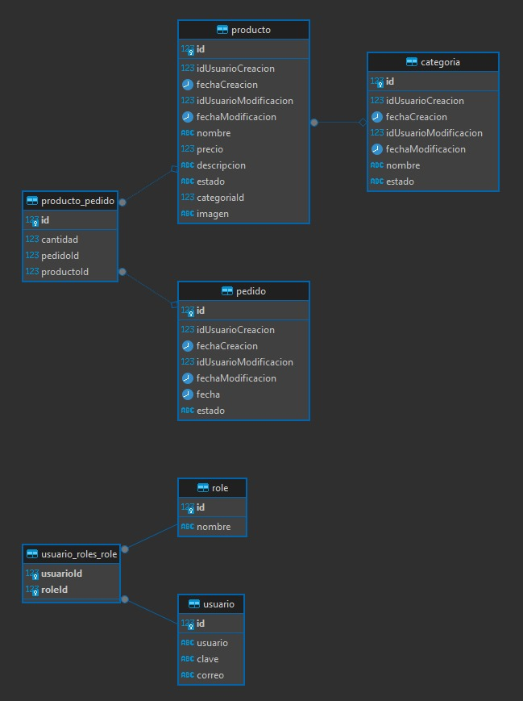

<p align="center">
  <a href="http://nestjs.com/" target="blank"></a>
</p>

## Description

[Nest](https://github.com/nestjs/nest) Proyecto Inicial en NestJs

## Project setup

```bash
$ npm install
```

```bash
$ npm run setup
```

## Compile and run the project

```bash
# development
$ npm run start

# watch mode
$ npm run start:dev
```


```bash
# production mode
$ npm run start:prod

# INSTRUCCIONES
# PRUEBAS UNITARIAS

# pruebas unitarias test:roleservice
$ npm run test:roleservice

# pruebas unitarias test:usuariosservice
$ npm run test:usuariosservice

# pruebas unitarias test:categoriasservice
$ npm run test:categoriasservice

```


## License

Nest is [MIT licensed](https://github.com/nestjs/nest/blob/master/LICENSE).


##base de datos
